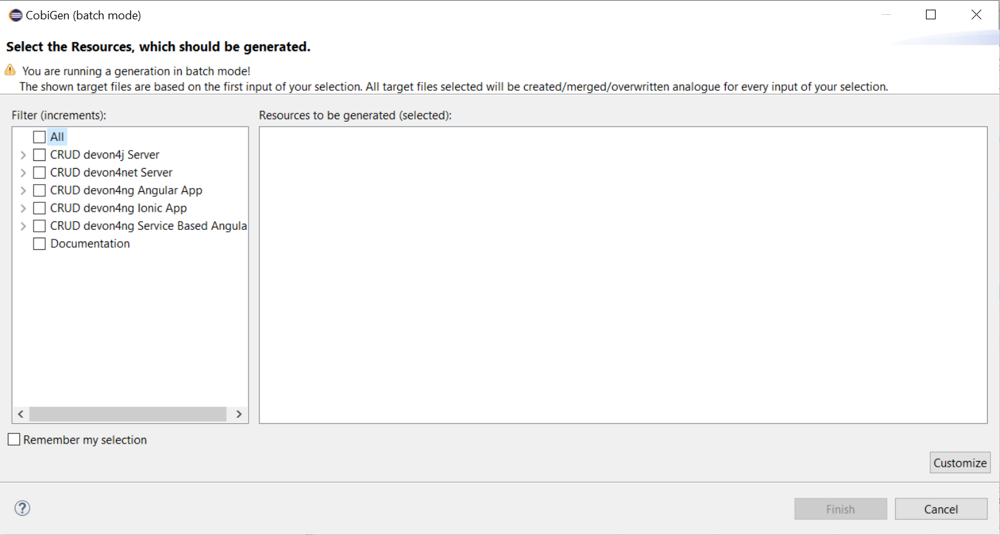

:toc: macro
toc::[]
:icons: font
:iconfont-remote!:
:iconfont-name: font-awesome
:stylesdir: css

= [navy]#devon4net Templates Guide#

== [navy]#Overview#

In this guide we will explain how to generate a new WebApi project from an OpenAPI 3.0.0 specification. This  means that we are going to use a “contract first” strategy. This is going to be possible due to these type of files that contain all the information about entities, operations, etc…

In order to make it work we are using https://github.com/devonfw/tools-cobigen[CobiGen], a powerful tool for generating source code. CobiGen allows users to generate all the structure and code of the components, helping to save a lot of time otherwise waisted on repetitive tasks.

== [navy]#Getting things ready#

=== [navy]#devonfw Distribution#

The devonfw distributions can be obtained from the https://coconet.capgemini.com/sf/frs/do/listReleases/projects.apps2_devon/frs.devon_distribution[TeamForge releases library] and are packaged in zips files that include all the needed tools, software and configurations.

It is not necessary to install nor configure anything. Just extracting the zip content is enough to have a fully functional devonfw. The only thing you have to do is run *create-or-update-workspace.bat* and then *update-all-workspaces.bat* to set up all the needed tools.

=== [navy]#CobiGen Templates#

In order to use CobiGen we will run *eclipse-main.bat* that we can find in the root folder of the devonfw distribution.

At this point we need to import the CobiGen_Templates from the main workspace. To do so, we only need to use Eclipse’s menu *File > Import > General > Existing Projects into Workspace* and browse to select the *workspaces/main/CobiGen_Templates directory*. Then click the Finish button and you should have the CobiGen_Templates as a new project in Eclipse’s workspace.

[[img-cobigen]]
image::images/cobigen_templates.png["cobigen", width="450", link="images/cobigen_templates.png"]

=== [navy]#devon4net Templates#

We are going to use the template of devon4net as a base to generate all the code, so what we have to do now is to download said template using the following steps.

First of all you have to set up all the environment for .NET, you can do this using https://devon4net.github.io/environment.html[the following tutorial]. Next we are going to create a new folder where we want to have the WebAPI project, lastly we are going to open the terminal there.

Type the following:

	dotnet new -i Devon4Net.WebAPI.Template
	
and then:

	dotnet new Devon4NetAPI
	
=== [navy]#OpenAPI File#

In order to let CobiGen generate all the files, we first have to make some modifications to our OpenAPI file. 

It is obligatory to put the _“x-rootpackage”_ tag to indicate where CobiGen will place the generated files as well as the _"x-component"_ tags for each component, keep in mind that due to CobiGen's limitations each component *_must_* have its own entity.

You can read more information about how to configure your OpenAPI file and a working example https://github.com/devonfw/tools-cobigen/wiki/cobigen-openapiplugin#full-example[here].

== [navy]#Generating files#
	
In order to generate the files we need to follow some simple steps.

First we are going to import our basic devon4net WebAPI Project into Eclipse. to do so open Eclipse with the “eclipse-main.bat” file that can be found in the devon distribution root folder. Once we are inside of Eclipse we go to *File > Open projects from file system...* and, under "Directory", search for your project.

[[img-cobigen]]
image::images/Project_selection.png["cobigen", width="600", link="images/Project_selection.png"]

Next we copy our OpenAPI file into the root folder of the project.

[[img-cobigen]]
image::images/OpenAPI_file_root_folder.png["cobigen", width="450", link="images/OpenAPI_file_root_folder.png"]

And then we right click on OpenAPI file and then select *CobiGen > Generate...* It will display a window like this:

[[img-cobigen]]

To select all .NET features choose *CRUD devon4net Server* otherwise you can select only those that interest you.

[[img-cobigen]]
image::images/cobigen_generate1.png["cobigen", width="800", link="images/cobigen_generate1.png]

Ones you select all the files that you want to generate, click on the _“Finish”_ button to generate all the source code.

After that, we open a terminal in the *[Project_Name]/Devon4Net.Application.WebAPI* and then type:

	dotnet run
	
This will deploy our application in our localhost with the port 8081, so when you click http://localhost:8081/swagger[here] (localhost:8081/swagger) you can see, in swagger, all the services and the data model.

== [navy]#Finishing touches#

After generating the files, locate the services created in *Devon4Net.Business.Common*

[[img-cobigen]]
image::images/Services.png["cobigen", width="300", link="images/Services.png]

Once you have find these you have to import them and add them into the _AddBusinessCommonDependencyInjectionService_ method found in *Bussiness/Devon4Net.Business.Common/Configuration/BusinessCommonConfiguration.cs*

[[img-cobigen]]
image::images/BussinessCommonConfiguration.png["cobigen", width="800", link="images/BussinessCommonConfiguration.png]

	
	
	
	
	
	
	
	
	
	
	
	
	
	
	
	
	
	
	
	
	
	
	
	
	
	
	
	
	
	
	
	
	
